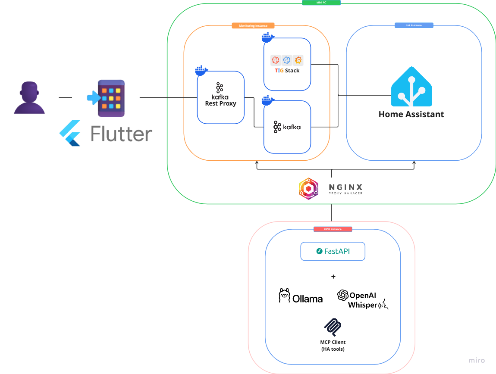
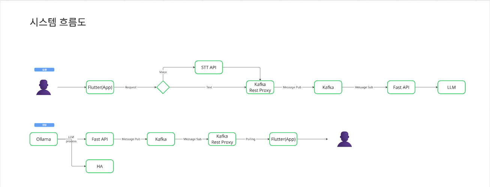

# Flutter IoT Chat Bot

> Flutter, Kafka, 그리고 Local LLM(Ollama)을 활용한 **Home Assistant 제어형 AI 챗봇 애플리케이션**

*(이미지 파일명을 실제 경로로 수정해주세요)*

## 목차

* [개요](https://www.google.com/search?q=%23%EA%B0%9C%EC%9A%94)
* [주요 기능](https://www.google.com/search?q=%23%EC%A3%BC%EC%9A%94-%EA%B8%B0%EB%8A%A5)
* [시스템 아키텍처](https://www.google.com/search?q=%23%EC%8B%9C%EC%8A%A4%ED%85%9C-%EC%95%84%ED%82%A4%ED%85%8D%EC%B2%98)
* [데이터 흐름](https://www.google.com/search?q=%23%EB%8D%B0%EC%9D%B4%ED%84%B0-%ED%9D%90%EB%A6%84)
* [기술 스택](https://www.google.com/search?q=%23%EA%B8%B0%EC%88%A0-%EC%8A%A4%ED%83%9D)
* [시작하기](https://www.google.com/search?q=%23%EC%8B%9C%EC%9E%91%ED%95%98%EA%B8%B0)
* [프로젝트 구조](https://www.google.com/search?q=%23%ED%94%84%EB%A1%9C%EC%A0%9D%ED%8A%B8-%EA%B5%AC%EC%A1%B0)
* [환경 설정](https://www.google.com/search?q=%23%ED%99%98%EA%B2%BD-%EC%84%A4%EC%A0%95)
* [트러블슈팅](https://www.google.com/search?q=%23%ED%8A%B8%EB%9F%AC%EB%B8%94%EC%8A%88%ED%8C%85)
* [라이선스](https://www.google.com/search?q=%23%EB%9D%BC%EC%9D%B4%EC%84%A0%EC%8A%A4)

---

## 개요

**Flutter IoT Chat Bot**은 사용자의 자연어 명령을 통해 집안의 IoT 기기를 제어하는 모바일 인터페이스입니다.

**Kafka REST Proxy**를 통해 모바일 앱과 홈 서버 간의 비동기 메시징을 처리하며, **Mini PC**와 **GPU 서버**로 이원화된 하이브리드 아키텍처를 채택했습니다. AI 모델(Ollama)은 사용자의 의도를 파악하고 **MCP(Model Context Protocol)** 클라이언트를 통해 Home Assistant를 제어합니다.

### 핵심 특징

* **하이브리드 인프라**: 데이터 수집/제어(Mini PC)와 AI 연산(GPU Instance)의 물리적 분리
* **비동기 처리**: Kafka를 활용한 대용량/비동기 메시지 파이프라인 구축
* **로컬 LLM 활용**: Ollama를 통한 프라이빗하고 비용 효율적인 AI 추론
* **스마트 홈 통합**: Home Assistant 및 TIG Stack을 통한 정교한 제어 및 모니터링

---

## 주요 기능

### 1. AI 기반 IoT 제어

* 자연어 명령("거실 불 켜줘")을 AI가 이해하여 Home Assistant 기기 제어
* MCP(Model Context Protocol) 기반의 Tool Use 구현

### 2. 실시간 대화 인터페이스

* Kafka Consumer Polling을 통한 실시간 응답 수신
* 타이핑 인디케이터 및 메시지 애니메이션 제공

### 3. 음성 인식 (STT) 지원

* 한국어 음성 인식 지원 (`speech_to_text`)
* 음성 → 텍스트 변환 후 자동 전송 파이프라인

### 4. 시스템 모니터링

* TIG Stack(Telegraf, InfluxDB, Grafana)을 통한 Kafka 및 시스템 상태 모니터링

---

## 시스템 아키텍처


시스템은 크게 **사용자 단말(Flutter)**, **홈 서버(Mini PC)**, **AI 연산 서버(GPU Instance)** 세 부분으로 구성됩니다.

```mermaid
graph TD
    User((User)) -->|Touch/Voice| App[Flutter App]
    
    subgraph "Mini PC (Home Server)"
        App -->|HTTP/REST| KRP[Kafka Rest Proxy]
        KRP -->|Publish| Kafka[Kafka Cluster]
        Kafka -->|Subscribe| HA[Home Assistant]
        TIG[TIG Stack] -.->|Monitor| Kafka
    end
    
    subgraph "GPU Instance (AI Server)"
        NGINX[Nginx Proxy Manager] -->|Reverse Proxy| FastAPI
        FastAPI -->|Request| Ollama[Ollama (LLM)]
        FastAPI -->|Request| Whisper[OpenAI Whisper]
        Ollama -->|Tool Call| MCP[MCP Client]
    end
    
    Kafka <-->|Message Sync| FastAPI
    MCP -.->|Control| HA

```

### 인프라 구성

1. **Flutter App**: 사용자 인터페이스 및 STT/Kafka Proxy 통신 담당
2. **Mini PC (Docker Environment)**
* **Kafka Ecosystem**: 메시지 브로커 및 REST Proxy
* **Home Assistant**: IoT 기기 통합 관리
* **TIG Stack**: 시스템 리소스 및 Kafka 성능 모니터링


3. **GPU Instance**
* **FastAPI**: AI 서비스 오케스트레이션
* **Ollama**: Llama/Mistral 등 Local LLM 구동
* **MCP Client**: AI의 의도를 HA 명령어로 변환


---

## 데이터 흐름


데이터 처리는 **요청(Request)**과 **응답(Response)**의 두 가지 비동기 흐름으로 나뉩니다.

### 1. 요청 흐름 (User → AI)

1. **User Input**: 텍스트 입력 또는 음성(Voice) → STT API 변환
2. **Flutter**: 변환된 텍스트를 `Kafka Rest Proxy`로 전송
3. **Kafka**: `chat-requests` 토픽에 메시지 적재
4. **FastAPI**: 메시지를 Subscribe하여 **LLM(Ollama)**에 프롬프트 전달

### 2. 응답 흐름 (AI → User)

1. **AI Process**: LLM이 의도 파악 후 **MCP Client**를 통해 **Home Assistant(HA)** 제어
2. **Result**: 제어 결과 및 AI 답변 생성
3. **FastAPI**: `chat-responses` 토픽에 결과 메시지 Publish
4. **Flutter**: Polling을 통해 `Kafka Rest Proxy`에서 응답 수신 후 UI 갱신

---

## 기술 스택

### Frontend (Mobile)

| 구분 | 기술 | 설명 |
| --- | --- | --- |
| **Framework** | Flutter | Cross-platform UI 개발 |
| **Network** | http | Kafka REST Proxy 통신 |
| **Input** | speech_to_text | 온디바이스 음성 인식 |

### Backend (Infrastructure)

| 구분 | 기술 | 설명 |
| --- | --- | --- |
| **Messaging** | Kafka, Zookeeper | 대용량 메시지 브로커 |
| **Interface** | Kafka REST Proxy | HTTP-Kafka 브릿지 |
| **IoT Platform** | Home Assistant | 스마트홈 기기 제어 허브 |
| **Monitoring** | TIG Stack | Telegraf, InfluxDB, Grafana |
| **Gateway** | Nginx Proxy Manager | 리버스 프록시 및 SSL 관리 |

### AI Core (GPU Server)

| 구분 | 기술 | 설명 |
| --- | --- | --- |
| **API Server** | FastAPI | Python 비동기 API 서버 |
| **LLM** | Ollama | 로컬 거대 언어 모델 실행 |
| **STT** | OpenAI Whisper | 고성능 서버사이드 음성 인식 |
| **Protocol** | MCP Client | Model Context Protocol (AI 도구 사용) |

---

## 시작하기

### 사전 요구사항

1. **Flutter SDK** (3.9.2 이상)
2. **Kafka REST Proxy 서버 접근 권한**
3. **Android Studio** 또는 **Xcode**

### 설치 및 실행

1. **저장소 클론**
```bash
git clone <repository-url>
cd iot-chat-bot/Flutter

```


2. **패키지 설치**
```bash
flutter pub get

```


3. **환경 설정**
   `lib/core/services/kafka_rest_service.dart` 파일에서 서버 주소를 수정합니다.
```dart
// Kafka REST Proxy가 실행 중인 Mini PC 주소
static const String restProxyUrl = 'http://YOUR_MINI_PC_IP:8082';

```


4. **앱 실행**
```bash
flutter run

```


---

## 프로젝트 구조

```
lib/
├── core/
│   ├── api/                 # Chat API 및 타임아웃 처리
│   ├── services/            # Kafka Rest Service (Consumer/Producer)
│   └── utils/               # 유틸리티 (UTF-8, Markdown 등)
├── models/                  # Message 모델 정의
├── screens/                 # ChatScreen (메인 UI)
├── widgets/                 # ChatBubble, BotAvatar, TypingIndicator
└── main.dart                # 앱 진입점

```

---

## 개발 가이드 (Kafka 연동)

이 프로젝트는 Kafka REST Proxy의 **Consumer Group** 기능을 사용하여 메시지를 관리합니다.

* **Topic 구조**:
* `chat-requests`: 사용자의 질문이 전송되는 토픽
* `chat-responses`: AI의 답변이 전송되는 토픽


* **Consumer 설정**:
* 각 앱 인스턴스는 고유한 `group.id` (UUID 기반)를 생성하여, 자신의 메시지만 정확히 수신합니다.
* `auto.offset.reset`: `earliest` 설정을 통해 유실 없이 메시지를 읽습니다.


---

## 트러블슈팅

**Q. 앱에서 메시지를 보냈는데 답장이 오지 않습니다.**

1. **네트워크 확인**: Flutter 앱이 Mini PC의 Kafka Rest Proxy 포트(8082)에 접근 가능한지 확인하세요.
2. **Consumer Group 확인**: 로그에서 `Creating consumer instance`가 성공했는지 확인하세요.
3. **GPU 서버 상태**: FastAPI 및 Ollama 컨테이너가 정상 작동 중인지 확인이 필요합니다.

**Q. 음성 인식이 작동하지 않습니다.**

* 앱 권한 설정에서 **마이크 권한**이 허용되어 있는지 확인해주세요.
* 에뮬레이터보다는 실제 기기에서의 테스트를 권장합니다.

---

## 라이선스

이 프로젝트는 [MIT License](https://www.google.com/search?q=LICENSE)를 따릅니다.

---

**Built with Flutter & Kafka** | Architecture by TIG & Home Assistant